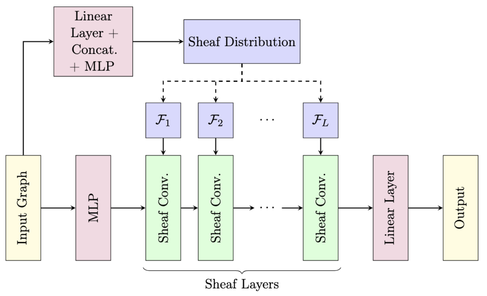

# Bayesian Sheaf Neural Networks

This repository contains the code for the paper 
**[Bayesian Sheaf Neural Networks]()**.


## Getting started

To set up the environment, run the following command:

```bash
conda env create --file=environment.yml
conda activate nsd
```

### Run Hyperparameter Sweep

To run a hyperparameter sweep, you will need a `wandb` account. Create a [Weights & Biases account](https://wandb.ai/site) and run the following
commands to log in and follow the displayed instructions:
```bash
wandb online
wandb login
```

Once you have an account, you can run an example
sweep as follows:
```bash
export ENTITY=<WANDB_ACCOUNT_ID>
wandb sweep --project bsnn config/bayesbundle_cora_sweep.yml
```
This will set up the sweep for a Bayesian sheaf neural network with orthogonal restriction maps on the Cora dataset.


## Acknowledgment

This repository builds upon the open-source codebase from [Neural sheaf diffusion repo](https://github.com/twitter-research/neural-sheaf-diffusion) (Apache 2.0 licensed). 
